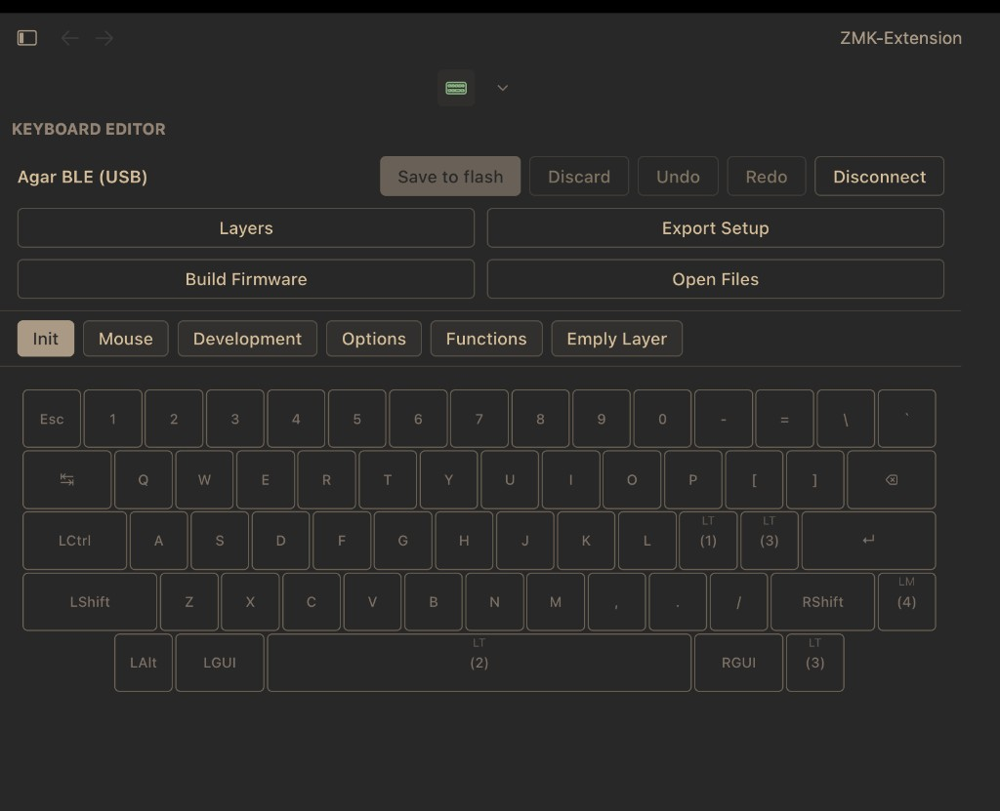
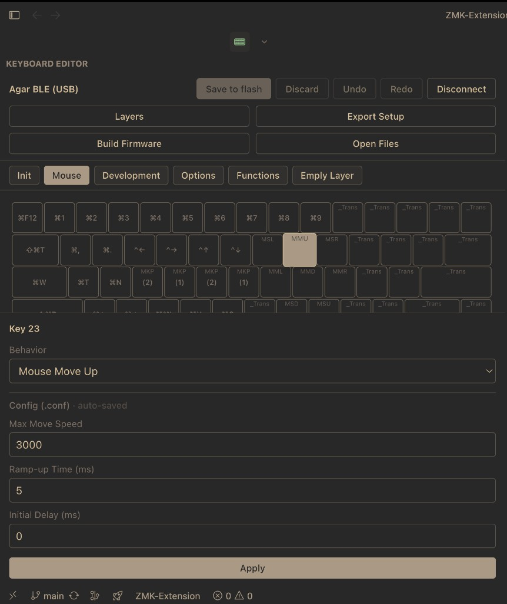
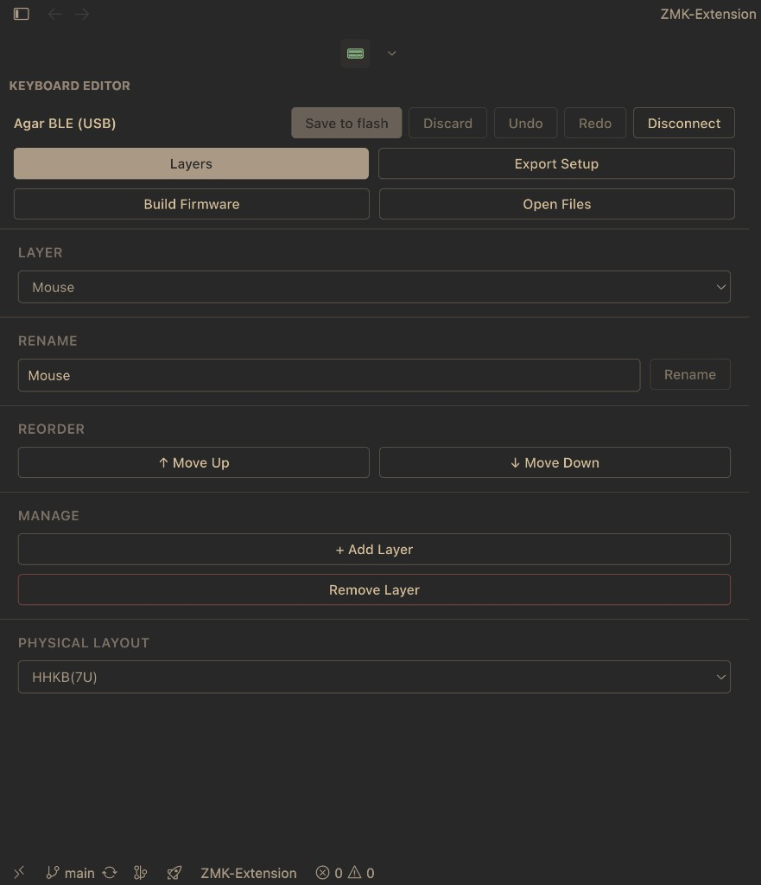

# ZMK Studio — VS Code Extension

A [VS Code](https://code.visualstudio.com/) and [Cursor](https://cursor.sh/) extension that brings the [ZMK Studio](https://zmk.dev/docs/features/studio) keyboard configuration interface into your editor. Edit keymaps live over USB or Bluetooth, export firmware build artifacts, and keep keyboard-specific config under extension storage — without a separate `~/zmk-studio` directory.

---

## Features

- **Live keymap editing** — ZMK Studio UI in the Activity Bar (React + `@zmkfirmware/zmk-studio-ts-client`)
- **USB** — serial RPC to ZMK keyboards with Studio enabled
- **Bluetooth (macOS)** — CoreBluetooth via native `bin/zmk-ble-helper` (bonded, connected peripherals — not advertising-only scan)
- **Save to flash** — write binding changes to the keyboard; syncs Kconfig values to the active keyboard’s `.conf` in extension storage
- **Export Setup** — one-click export of `.zmkmap` snapshot, generated `.keymap`, and `.conf` into that keyboard’s storage folder
- **Firmware builds** — `west build` from extension-owned globalStorage with pre-flight checks; copies `.uf2` into the keyboard folder when done
- **Per-keyboard storage** — each connected keyboard gets its own folder under globalStorage (`keymaps/<name>/`)
- **Extension log** — Output channel for connection and build diagnostics

---

## Screenshots

Keyboard editor (layers + keymap grid):



Key options (example: mouse movement parameters written to (`.conf`):



Layer management (rename/reorder/add/remove + physical layout):



---

## Requirements

| Requirement | Details |
|-------------|---------|
| **Operating system** | macOS for Bluetooth; USB serial works on other platforms where `serialport` is supported |
| **Editor** | VS Code or Cursor 1.94.0+ |
| **ZMK firmware** | Built with `CONFIG_ZMK_STUDIO=y` on the keyboard |
| **Bluetooth (macOS)** | Permission granted to the editor on first BLE connect |
| **`west`** (firmware builds) | [Install west](https://docs.zephyrproject.org/latest/develop/west/install.html) — workspace is created under extension globalStorage on first build |

---

## Installation

### From GitHub Releases

1. Open [Releases](https://github.com/no-complect/zmk-extension/releases) and download the latest `zmk-studio-vscode-*.vsix`
2. In VS Code or Cursor: **Extensions** → `···` → **Install from VSIX…**
3. Select the downloaded file

Pushes to `main` also run CI that builds a universal macOS `zmk-ble-helper` and publishes a matching release when the version in `package.json` is new.

### From source

See [Development setup](#development-setup).

---

## Quick start

1. Open the **ZMK Studio** view in the Activity Bar (or **ZMK: Open Keyboard Editor**).
2. Connect via **Scan (USB)** or **Connect (BLE)** (macOS).
3. Unlock the keyboard with your firmware’s Studio unlock combo if the panel shows “Waiting for unlock…”.
4. Edit keys, then **Save to flash** to persist to the device (and sync config to extension storage).
5. Use **Export Setup** when you want `.zmkmap`, `.keymap`, and `.conf` files written to disk for `west build`.

---

## Usage

### Connecting

**USB**

1. Plug in the keyboard.
2. Click **Scan (USB)** or run **ZMK: Connect via USB**.
3. Pick a port if several devices appear.

**Bluetooth (macOS)**

1. Pair and connect the keyboard in **System Settings → Bluetooth**.
2. Click **Connect (BLE)** in the panel.
3. Allow Bluetooth access when macOS prompts.

The BLE helper uses `retrieveConnectedPeripherals` (same idea as the desktop ZMK Studio app), so the keyboard does not need to be advertising.

### Editing and saving

- Select a layer tab, click a key, and change its binding in the editor.
- **Save to flash** applies pending binding changes to the keyboard and exports the current Kconfig snapshot to that keyboard’s `.conf` in extension storage.
- If Kconfig values changed, you’ll be prompted to rebuild firmware (see below).

### Export Setup

**Export Setup** (toolbar) writes to the current keyboard’s storage folder:

- `<name>-YYYY-MM-DD.zmkmap` — JSON snapshot
- `<shield>.keymap` — generated devicetree keymap (when behaviors are available)
- `.conf` — via the same path as **ZMK: Export Configuration File**

Use **Open Files** to reveal the folder in Finder.

### Configuration files

- **ZMK: Select Configuration File** — pick an external `.conf`; it is **copied** into extension storage and linked for that keyboard.
- **ZMK: Export Configuration File** — writes the in-memory Kconfig store to the keyboard’s canonical `.conf` in storage (no separate save dialog).
- Layer-level Kconfig options are available from the **Layers** panel when connected.

Board/shield for builds are stored in `zmk-config.json`, resolved from the west manifest when possible, or prompted once and cached.

### Building firmware

1. Click **Build Firmware** (panel or **ZMK: Build Firmware**).
2. On first use, confirm **Set up workspace** — the extension runs `west init` + `west update` in **extension globalStorage** (~2 GB). Requires `west` on your `PATH`.
3. Pre-flight checks run in the **ZMK Studio — Rebuild** output channel (ZMK/Zephyr tree, board, config dir, keymap, `.conf`).
4. A terminal opens with `west build`; `-DZMK_CONFIG` points at the current keyboard’s storage folder when artifacts exist there.
5. When the build finishes, `zmk.uf2` is copied into that keyboard’s folder.

**ZMK: Manage West Workspace** — run `west update` or re-initialize the extension storage checkout.

**ZMK: Clear Cached Board/Shield** — clear stored board/shield so the next build prompts again.

### Unlocking

Studio-enabled firmware locks the keymap until you press the unlock combo defined in your keymap. The panel updates automatically when unlocked.

---

## Where data is stored

All extension state lives under **extension globalStorage** (not the repo, not `~/zmk-studio`):

| Location | Purpose |
|----------|---------|
| `zmk-config.json` | Kconfig values, linked `.conf` path, cached board/shield |
| `west-workspace/` | West checkout for `west build` (created on first build) |
| `keymaps/<keyboard-name>/` | Per-keyboard folder (from device display name, e.g. `agar-ble`) |
| `keymaps/<keyboard-name>/<shield>.conf` | Config for builds and Studio |
| `keymaps/<keyboard-name>/<shield>.keymap` | Exported devicetree keymap |
| `keymaps/<keyboard-name>/*.zmkmap` | Dated snapshots |
| `keymaps/<keyboard-name>/zmk.uf2` | Last successful build artifact |

On connect, the extension loads or creates that keyboard’s folder and links its `.conf`. Older releases that stored west paths or board/shield only in `globalState` are migrated once at activation.

**macOS path (example):**

`~/Library/Application Support/Cursor/User/globalStorage/zmk-studio.zmk-studio-vscode/`

(Use `Code` instead of `Cursor` for VS Code.)

---

## Commands

All commands are under **ZMK** in the Command Palette (`Cmd+Shift+P`).

| Command | Description |
|---------|-------------|
| **Open Keyboard Editor** | Focus the ZMK Studio sidebar |
| **Connect via USB** | Scan serial ports and connect |
| **Build Firmware** | Pre-flight checks and `west build` terminal |
| **Manage West Workspace** | `west update` or re-init extension storage workspace |
| **Clear Cached Board/Shield** | Reset stored board/shield for the next build |
| **Show Extension Log** | Open the ZMK Studio output channel |
| **Select Configuration File** | Import an external `.conf` into extension storage |
| **Export Configuration File** | Write Kconfig store to the keyboard’s `.conf` in storage |
| **Import Keymap** | Load a `.zmkmap` and apply bindings to the connected keyboard |

---

## Architecture

```
┌─────────────────────────────────────────┐
│  Extension host (Node.js)               │
│  extension.ts → KeyboardPanelProvider   │
│    ├── SerialTransport (USB)            │
│    ├── CoreBluetoothTransport (BLE)     │
│    │     └── bin/zmk-ble-helper (ObjC) │
│    ├── ZmkConfigStore / extensionStorage│
│    └── MessageBridge ↔ WebView          │
└──────────────────┬──────────────────────┘
                   │ postMessage
┌──────────────────▼──────────────────────┐
│  WebView (React)                          │
│  App.tsx + contexts/hooks/components     │
│  @zmkfirmware/zmk-studio-ts-client RPC   │
└──────────────────────────────────────────┘
```

- **BLE:** WebViews cannot use `navigator.bluetooth`; CoreBluetooth runs in a subprocess with newline-delimited JSON on stdin/stdout.
- **UI:** Reuses the ZMK Studio TypeScript client and a React layout editor rather than native VS Code widgets.

---

## Project structure

```
ZMK-Extension/
├── src/                          # Extension host
│   ├── extension.ts              # Activation, commands
│   ├── KeyboardPanelProvider.ts  # WebView, connect, build, export
│   ├── extensionStorage.ts       # globalStorage paths (west, keymaps)
│   ├── legacyStorage.ts          # One-time migration from old globalState
│   ├── ZmkConfigStore.ts         # zmk-config.json persistence
│   ├── ZmkConfigLoader.ts        # West manifest / config discovery
│   ├── ZmkConfigParser.ts        # build.yaml, west.yml, .conf parsing
│   ├── logger.ts
│   ├── transport/
│   │   ├── SerialTransport.ts
│   │   ├── CoreBluetoothTransport.ts
│   │   └── MessageBridge.ts
│   └── __tests__/
├── webview/                      # React UI (webpack → dist/webview.js)
│   ├── App.tsx                   # Connect screen + keyboard editor
│   ├── components/               # Layout, binding editor, layer options
│   ├── contexts/                 # Connection, keymap, config, selection
│   ├── hooks/
│   ├── lib/                      # keymapGenerator, HID helpers
│   ├── transport/BridgeTransport.ts
│   └── ui/                       # shadcn-style primitives
├── shared/messages.ts            # Host ↔ WebView message types
├── native/zmk-ble-helper.m
├── bin/zmk-ble-helper            # Built locally (gitignored)
├── media/zmk-icon.svg
├── dist/                         # Webpack output (gitignored)
└── .github/workflows/release.yml # Release .vsix on main
```

---

## Development setup

### Prerequisites

- macOS (to build/test BLE helper)
- Node.js 20–22 (see `.nvmrc`)
- VS Code or Cursor 1.94+
- Xcode Command Line Tools: `xcode-select --install`

### Clone and build

```bash
git clone https://github.com/no-complect/zmk-extension.git
cd zmk-extension
nvm use          # or: nvm install
npm run setup
```

`npm run setup` runs `npm install` and `vscode:prepublish` (native binary + production webpack).

### Run in the Extension Development Host

1. Open this folder in VS Code/Cursor.
2. Press **F5** (or **Run → Start Debugging**).
3. In the new window, open the ZMK Studio Activity Bar view.

For day-to-day edits: `npm run dev:full`, then **Developer: Reload Window** in the Extension Development Host after changes.

### Tests

```bash
npm test
```

Covers `ZmkConfigParser` and west workspace config detection (`tsx`, no separate build).

### Native binary

After editing `native/zmk-ble-helper.m`:

```bash
npm run build:native
```

### Clean

```bash
npm run clean
```

Removes `node_modules`, `dist`, `bin/zmk-ble-helper`, any repo-local `keymaps/` or `.vsix` files. Does **not** delete extension globalStorage (your keyboards and west checkout remain).

### Optional: repo-local west workspace

`npm run setup:west` creates `./west-workspace/` in the **repository** for manual hacking. The extension runtime always uses **globalStorage/west-workspace** instead.

---

## Scripts

| Script | Description |
|--------|-------------|
| `setup` | `npm install` + native build + production webpack |
| `clean` | Remove generated artifacts in the repo |
| `setup:west` | Init optional `./west-workspace/` (not used by the extension at runtime) |
| `dev` | Webpack watch (native binary must exist) |
| `dev:full` | `build:native` then `dev` |
| `build` | Production webpack |
| `build:native` | Compile `zmk-ble-helper` for current CPU |
| `build:ext` / `build:webview` | Single-target dev builds |
| `test` / `test:parser` / `test:detector` | Run tests |
| `package` | Native + webpack + `.vsix` |
| `install:vscode` / `install:cursor` | Package and install locally |

---

## Packaging

```bash
npm run package
```

CI builds a **universal** `zmk-ble-helper` (arm64 + x86_64) before packaging. For a local universal binary:

```bash
mkdir -p bin
clang -fobjc-arc -framework CoreBluetooth -framework Foundation \
  -target arm64-apple-macos11 -o bin/zmk-ble-helper-arm64 native/zmk-ble-helper.m
clang -fobjc-arc -framework CoreBluetooth -framework Foundation \
  -target x86_64-apple-macos10.15 -o bin/zmk-ble-helper-x86 native/zmk-ble-helper.m
lipo -create bin/zmk-ble-helper-arm64 bin/zmk-ble-helper-x86 -output bin/zmk-ble-helper
rm bin/zmk-ble-helper-arm64 bin/zmk-ble-helper-x86
npm run package
```

---

## Troubleshooting

**Bluetooth off or denied**  
System Settings → Privacy & Security → Bluetooth → enable your editor.

**Keyboard not found over BLE**  
Ensure it shows as **connected** in System Settings (not only paired).

**`zmk-ble-helper` not found**  
Run `npm run build:native` (or reinstall from a release `.vsix` that includes the binary).

**Blank panel / extension not activating**  
**ZMK: Show Extension Log** for details.

**Locked after connect**  
Use your firmware’s Studio unlock combo.

**Board/shield missing at build**  
Enter when prompted; values are saved in `zmk-config.json`. Use **Clear Cached Board/Shield** to reset.

**`npm install` / node-gyp failures**  
Use Node 22 via nvm (`nvm use`), not Homebrew Node 25. This repo’s `.npmrc` points node-gyp at `/usr/bin/python3`. If `which node` is still Homebrew, run `brew unlink node` or fix shell init order.

---

## Related projects

- [ZMK Firmware](https://github.com/zmkfirmware/zmk)
- [ZMK Studio](https://github.com/zmkfirmware/zmk-studio)
- [zmk-studio-ts-client](https://github.com/zmkfirmware/zmk-studio-ts-client)

---

## License

MIT
